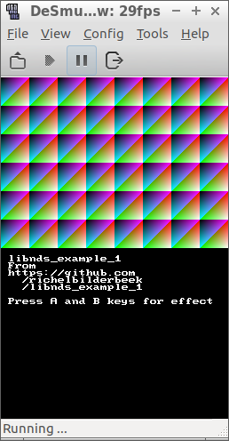

# libnds_example_1

This GitHub is part of 

 * [my NDS webpages](https://github.com/richelbilderbeek/cpp/blob/master/content/CppNds.md)

## External links

 * [travis_qmake_gcc_cpp98_libnds](https://github.com/richelbilderbeek/travis_qmake_gcc_cpp98_libnds)
 * [libnds_example_2](https://github.com/richelbilderbeek/libnds_example_2)
